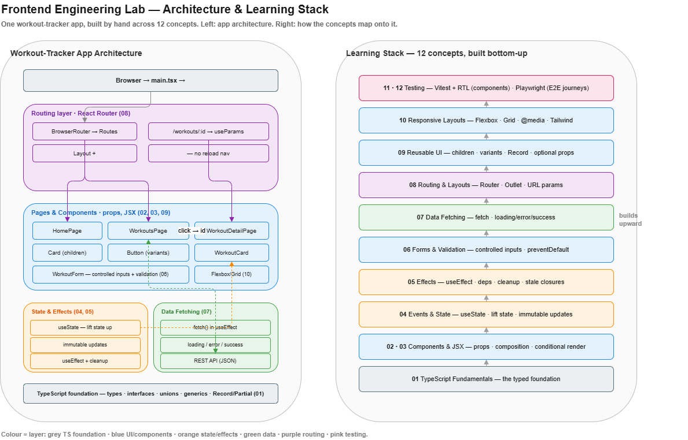

# Frontend Engineering Lab


A focused frontend engineering lab where I build a strong foundation in modern
frontend development by implementing one core concept at a time — from scratch,
by hand — and documenting the engineering decisions behind each implementation.

Rather than chasing frontend frameworks or trends, this lab focuses on the
fundamental engineering concepts behind modern user interfaces: components,
state, effects, routing, forms, API integration, and testing. Everything is
built around one running example — a workout tracker — so each concept extends
a real, growing application rather than a throwaway snippet.

Each concept lives in its own self-contained folder with runnable code, concise
documentation, and implementation notes explaining the underlying ideas, the
bugs I hit, and the engineering principles behind the fix.

---

## Architecture



The diagram shows both views at once. **Left:** the workout-tracker app
architecture — how the browser reaches `App`, flows through the routing layer,
into pages and reusable components, backed by the state/effects and data
layers, all resting on a TypeScript foundation. **Right:** the learning stack —
the twelve concepts built bottom-up, each resting on the ones below. Colour ties
the two together: a concept on the right shares the colour of the app layer it
produces on the left (grey = TypeScript foundation, blue = UI/components,
orange = state/effects, green = data, purple = routing, pink = testing).

The [editable diagram](assets/architecture.drawio) can be opened at
[app.diagrams.net](https://app.diagrams.net) or with the draw.io editor.

---

## Philosophy

This repository follows the same learning philosophy as the Python Engineering
Lab.

* One engineering concept at a time, at a sustainable pace.
* Write every line myself, from understanding, before consulting references —
  no copying, including from any AI reviewing the work.
* Struggle with each concept until it works, *then* have it reviewed — not
  written for me, but reviewed the way a senior colleague would.
* Learn from the breakage: most concepts here were understood by first watching
  them fail, then fixing them.
* Document not only *what* works, but *why* it works — and honestly note what
  was deferred.

The goal is not to master a framework overnight, but to close the gap between
what modern tools can generate and what I can genuinely build and explain
myself.

---

## Getting Started

You'll need:

* Node.js
* npm

```powershell
git clone https://github.com/ajitagupta/frontend-engineering-lab.git
cd frontend-engineering-lab
```

Each folder is completely self-contained.

```powershell
cd 01-typescript-fundamentals
npm install
npm run dev
```

Follow the README inside each folder for setup instructions and learning notes.

---

## Roadmap

All twelve concepts complete.

| Concept | Skill | Status | Folder |
|---------|-------|--------|--------|
| 01 — TypeScript Fundamentals | Typed variables, interfaces, union & literal types, generics, utility types (`Partial`, `Record`) | ✅ Done | [01-typescript-fundamentals](01-typescript-fundamentals/) |
| 02 — Component Architecture | Components, typed props, composition, list rendering with `.map()`, stable keys | ✅ Done | [02-component-architecture](02-component-architecture/) |
| 03 — JSX & Rendering | Conditional rendering (`&&`, ternary, early return), the `&&` zero-trap, empty states | ✅ Done | [03-jsx-rendering](03-jsx-rendering/) |
| 04 — Events & State | `useState`, the setter-triggers-render model, immutable updates, lifting state up, Context basics | ✅ Done | [04-events-state](04-events-state/) |
| 05 — Effects & Browser APIs | `useEffect`, dependency arrays, cleanup & leaks, effects run *after* render, stale closures | ✅ Done | [05-effects-browser-apis](05-effects-browser-apis/) |
| 06 — Forms & Validation | Controlled inputs, reactive validation, `onSubmit` + `preventDefault`, handlers-do-vs-JSX-shows | ✅ Done | [06-forms-validation](06-forms-validation/) |
| 07 — Data Fetching | `fetch`, three-state async modelling (loading/error/success), why `fetch` doesn't throw on HTTP errors | ✅ Done | [07-data-fetching](07-data-fetching/) |
| 08 — Routing & Layouts | Client-side routing, `<Link>` vs `<a>`, layouts with `<Outlet />`, URL params with `useParams` | ✅ Done | [08-routing-layouts](08-routing-layouts/) |
| 09 — Reusable UI Components | The `children` prop, variants via typed props, `Record` lookups, optional props with defaults | ✅ Done | [09-reusable-ui](09-reusable-ui/) |
| 10 — Responsive Layouts | Flexbox (main/cross axis), CSS Grid, `@media` breakpoints, Tailwind as shorthand | ✅ Done | [10-responsive-layouts](10-responsive-layouts/) |
| 11 — Component Testing | Vitest + React Testing Library, rendering & interaction tests, testing behaviour over implementation | ✅ Done | [11-component-testing](11-component-testing/) |
| 12 — End-to-End Testing | Playwright, real-browser user journeys, integration vs isolation, `webServer` config | ✅ Done | [12-e2e-testing](12-e2e-testing/) |

---

## Tech Stack

Intentionally kept to a minimum:

* **React** + **TypeScript** — typed, component-based UI
* **Vite** — dev server and build tooling
* **React Router** — client-side routing
* **Tailwind CSS** — utility-first responsive styling (learned on top of plain Flexbox/Grid)
* **Vitest** + **React Testing Library** — component testing
* **Playwright** — end-to-end testing

The goal is not to learn a large ecosystem of libraries, but to build a solid
understanding of the core engineering patterns behind modern frontend
applications.

---

## What I Can Now Do — and Explain

By completing this lab I can build a complete React application from scratch and
account for every line:

* Build reusable, composable components with typed props and flexible variants
* Write type-safe frontend code (interfaces, unions, generics, utility types)
* Manage state and user interactions, and reason about *when and why* React re-renders
* Synchronise with external systems using effects — and know when *not* to reach for one
* Build forms with controlled inputs and reactive validation
* Consume REST APIs with proper loading, error, and success handling
* Structure multi-page applications with routing, layouts, and URL params
* Build responsive layouts with Flexbox, Grid, and Tailwind
* Test at both levels — components in isolation (RTL/Vitest) and complete user journeys in a real browser (Playwright)

The objective was to master the frontend fundamentals before moving on to
advanced topics such as authentication, state-management libraries, performance
optimisation, accessibility, design systems, and production engineering.

---

*A frontend engineering practice project documenting my journey toward becoming
a stronger software engineer — one concept genuinely understood at a time.
Sequel to the [Python Engineering Lab](https://github.com/ajitagupta/python-engineering-lab).*
